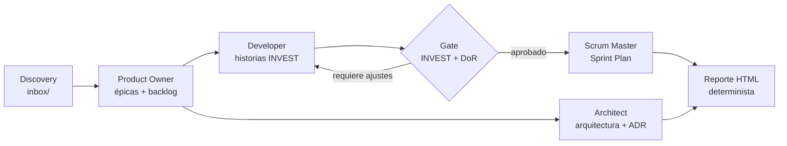

# Agile Delivery Team

Equipo multiagente para **Claude Code** que transforma los resultados de un proceso de discovery en un plan de entrega ágil, trazable y listo para construir.

El proyecto coordina cuatro roles especializados —Product Owner, Developer, Scrum Master y Architect— para producir épicas, un backlog priorizado, historias que cumplen INVEST y Definition of Ready, arquitectura documentada mediante ADR, un Sprint Plan y un reporte HTML. No genera código de producción: su alcance es preparar y gobernar el delivery.

## Qué problema resuelve

Entre el discovery y la implementación suele existir una zona gris: requisitos sin priorizar, historias demasiado grandes, decisiones técnicas sin contexto y planes de sprint construidos sobre supuestos. Este proyecto convierte los hallazgos del discovery en artefactos auditables y aplica controles automáticos antes de declarar que una historia está lista.

Sus principios son:

- **Valor antes que solución:** prioriza outcomes e impacto, no facilidad técnica.
- **Cero invención:** cada elemento debe estar respaldado por el `inbox/`; lo desconocido se registra como pregunta abierta.
- **Trazabilidad de extremo a extremo:** épicas, historias y ADR citan su origen.
- **Calidad ejecutable:** un hook valida INVEST y Definition of Ready antes de permitir ciertos artefactos.
- **Aislamiento:** cada iniciativa vive en su propio directorio dentro de `deliveries/`.
- **Simplicidad:** la arquitectura propuesta busca maximizar el trabajo no realizado.

## Flujo de trabajo



### Roles del equipo

| Rol | Responsabilidad principal | Pregunta guía |
|---|---|---|
| Product Owner | Descompone el MVP y prioriza el backlog por valor. | ¿Estamos construyendo lo correcto? |
| Developer | Refina, estima y divide historias hasta cumplir INVEST. | ¿Cómo lo construimos bien? |
| Scrum Master | Protege la Definition of Ready, el foco y la capacidad del sprint. | ¿Qué frena al equipo? |
| Architect | Define una estructura técnica simple y registra decisiones en ADR. | ¿Qué estructura sostiene esto en el tiempo? |

## Requisitos

- [Claude Code](https://docs.anthropic.com/en/docs/claude-code) con soporte para agentes, comandos y hooks.
- Python 3.9 o superior disponible como `python3`.
- Entradas de discovery en Markdown y JSON con la estructura descrita abajo.

El proyecto no requiere paquetes de Python externos: tanto el gate como el generador del reporte usan únicamente la biblioteca estándar.

## Inicio rápido

### 1. Crea un delivery

```text
deliveries/<nombre>/
├── inbox/
└── outputs/
```

Ejemplo:

```bash
mkdir -p deliveries/mi-producto/inbox deliveries/mi-producto/outputs
```

### 2. Copia los insumos de discovery

El directorio `inbox/` es la fuente de verdad y se trata como **solo lectura** durante el delivery:

```text
inbox/
├── mvp-canvas.md
├── user-stories.md
├── requisitos.md
├── personas.md
└── evidence-map.json
```

Si falta información, el equipo debe registrarla en `open_questions`; nunca completarla con datos inventados.

### 3. Ejecuta los comandos en orden

Desde Claude Code, en la raíz del repositorio:

```text
/delivery:generate-epics deliveries/mi-producto
/delivery:generate-stories deliveries/mi-producto
/delivery:architecture deliveries/mi-producto
/delivery:sprint-plan deliveries/mi-producto 20
/delivery:report deliveries/mi-producto
```

`architecture` puede ejecutarse en paralelo con el refinamiento una vez que exista `backlog.json`. El número `20` es la capacidad del sprint; si no se indica, se utiliza 20 puntos por defecto.

### 4. Revisa los resultados

```text
outputs/
├── epics.md
├── backlog.json
├── stories.md
├── architecture.md
├── adr/
│   └── ADR-NNNN-<decision>.md
├── sprint-plan.md
├── sprint-plan.json
└── report.html
```

Abre `report.html` en un navegador para consultar el backlog por épica, el estado de preparación de las historias y el Sprint Plan.

## Comandos disponibles

| Comando | Responsable | Entradas | Salidas |
|---|---|---|---|
| `/delivery:generate-epics <delivery>` | Product Owner | `inbox/` | `epics.md`, `backlog.json` |
| `/delivery:generate-stories <delivery>` | Developer y Scrum Master | `inbox/`, `backlog.json` | `stories.md`, `backlog.json` refinado |
| `/delivery:architecture <delivery>` | Architect | `inbox/`, épicas o backlog | `architecture.md`, ADR |
| `/delivery:sprint-plan <delivery> [capacidad]` | Scrum Master y Developer | backlog refinado | `sprint-plan.md`, `sprint-plan.json` |
| `/delivery:report <delivery>` | Script determinista | backlog y Sprint Plan opcional | `report.html` |

El reporte también se puede regenerar directamente:

```bash
python3 .claude/scripts/build-report.py deliveries/mi-producto
```

## Gate INVEST y Definition of Ready

`.claude/hooks/dor-invest-gate.py` se ejecuta antes de escribir o editar `stories.md` y `sprint-plan.md`. Lee el `backlog.json` del mismo delivery y bloquea la operación cuando una historia incumple alguna de estas condiciones:

- contiene `as_a`, `want` y `so_that`;
- tiene al menos un criterio de aceptación verificable;
- posee una estimación entera mayor que cero;
- no supera el tamaño máximo permitido;
- sus dependencias apuntan a historias existentes;
- no conserva preguntas abiertas bloqueantes.

El máximo predeterminado es de 8 puntos y puede configurarse para una ejecución:

```bash
DELIVERY_MAX_POINTS=5 claude
```

> **Importante:** actualmente el gate valida **todas las historias del backlog**, no solo las seleccionadas para un sprint. Si bloquea una escritura, se debe corregir `backlog.json` y volver a intentarlo; cambiar el nombre del archivo para evitar el control rompe la gobernanza del proyecto.

## Estructura del repositorio

```text
.
├── .claude/
│   ├── agents/                  # Definición de los cuatro roles
│   ├── commands/delivery/       # Orquestación de cada etapa
│   ├── hooks/                   # Gate automático INVEST + DoR
│   ├── scripts/                 # Generador determinista del reporte
│   ├── skills/delivery/         # Formatos canónicos de los artefactos
│   └── settings.json            # Registro del hook PreToolUse
├── deliveries/
│   └── <nombre>/
│       ├── inbox/               # Evidencia de discovery; solo lectura
│       └── outputs/             # Artefactos generados
├── CLAUDE.md                    # Constitución y reglas del equipo
└── README.md
```

## Contratos de datos

`backlog.json` es la fuente estructurada que conecta al Product Owner, Developer, gate y reporte. Cada historia debe conservar, como mínimo:

```json
{
  "id": "US-01",
  "epic": "E-01",
  "as_a": "persona o rol",
  "want": "capacidad deseada",
  "so_that": "resultado de valor",
  "acceptance_criteria": [
    "Dado un contexto, cuando ocurre una acción, entonces se obtiene un resultado verificable."
  ],
  "estimate": 3,
  "dependencies": [],
  "open_questions": [],
  "priority": 1,
  "origin": ["referencia al inbox"]
}
```

Los criterios deben seguir una forma Gherkin comprensible (`Dado / Cuando / Entonces`) y cada ADR utiliza un formato MADR breve con contexto, decisión, alternativas y consecuencias. Los contratos completos están en `.claude/skills/delivery/SKILL.md`.

## Ejemplo incluido

`deliveries/citasdentista/` demuestra el proceso completo para un sistema de reserva de citas odontológicas:

- 4 épicas orientadas a resultados;
- 8 historias listas, con 38 puntos en total;
- Sprint 1 con 4 historias y 18 de 20 puntos comprometidos;
- arquitectura de monolito modular con persistencia transaccional;
- 5 ADR trazables;
- reporte HTML generado desde los archivos JSON.

Este ejemplo sirve como referencia de estructura y nivel de detalle, no como plantilla de contenido: cada nuevo delivery debe derivarse exclusivamente de su propio `inbox/`.

## Desarrollo y verificación

Antes de integrar cambios:

1. Conserva los identificadores (`E-NN`, `US-NN`, `ADR-NNNN`) y referencias de origen.
2. Mantén sincronizados los artefactos Markdown con sus equivalentes JSON.
3. No edites manualmente `report.html`; regénéralo desde los JSON.
4. Verifica la sintaxis de los scripts:

   ```bash
   python3 -m py_compile .claude/hooks/dor-invest-gate.py .claude/scripts/build-report.py
   ```

5. Ejecuta nuevamente `/delivery:report` y revisa visualmente el resultado.

## Solución de problemas

### El gate bloquea `stories.md` o `sprint-plan.md`

Lee el mensaje del hook: identifica la historia y la regla incumplida. Corrige primero `outputs/backlog.json` y reintenta la operación.

### No existe `backlog.json`

Ejecuta `/delivery:generate-epics <delivery>` antes de refinar historias, planificar el sprint o generar el reporte.

### `python3` no se reconoce en Windows

Instala Python y habilita el alias `python3`, o adapta de forma consistente los comandos de `.claude/settings.json` y `.claude/commands/delivery/report.md` al ejecutable disponible en tu entorno.

### El reporte no refleja los cambios

Comprueba que `backlog.json` y `sprint-plan.json` sean JSON válidos y vuelve a ejecutar `/delivery:report <delivery>`.

## Alcance y limitaciones

- El equipo planifica el delivery; no implementa ni despliega el producto.
- La calidad semántica de los criterios sigue requiriendo revisión humana, aunque el gate valide su estructura mínima.
- No se define una velocidad universal: la capacidad debe basarse en evidencia del equipo.
- Las decisiones arquitectónicas son propuestas contextualizadas, no sustituyen pruebas técnicas ni revisión de seguridad.
- El reporte replica las comprobaciones principales del gate, pero el hook es la autoridad para permitir o bloquear la escritura.

## Licencia

Este repositorio no incluye actualmente un archivo de licencia. Añade uno antes de distribuirlo o reutilizarlo fuera de su contexto original.
