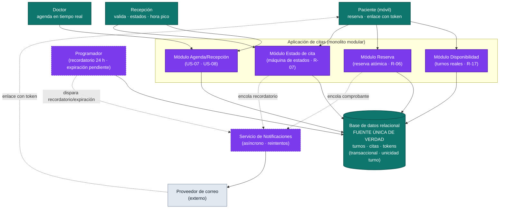

# Arquitectura — citasdentista

> Generada por el **Architect** desde `outputs/backlog.json`, `outputs/epics.md` y
> el `inbox/` (mvp-canvas, requisitos, personas). Cada decisión técnica traza a una
> fuerza real (req:R-NN, épica E-NN, historia US-NN o riesgo/pain del MVP). Lo no
> respaldado por el descubrimiento se declara como **open question**, no como hecho.

---

## 1. Visión y justificación (valor + simplicidad)

El MVP debe lograr una cosa antes que cualquier otra: que paciente, recepción y
doctor trabajen sobre **una sola fuente de verdad** en lugar del caos de
WhatsApp/llamada/papel (`mvp-canvas.md` → propuesta de valor;
`pain:multiples-canales-sin-fuente-verdad`). Su **mayor riesgo no es técnico sino de
adopción**: si el sistema es complejo o lento en hora pico, recepción vuelve al
cuaderno (`riesgo-abandono-sistema`, **R-15**, **R-16**).

Por eso la arquitectura elegida es **lo más simple que funciona**: **una sola
aplicación (monolito modular)** sobre una **base de datos relacional transaccional**
que es la fuente única de verdad de turnos y citas (ADR-0001). Sobre ese núcleo, dos
piezas internas dan asincronía donde el valor la exige —**Servicio de
Notificaciones** y **Programador**— sin sumar infraestructura distribuida. Se evita
deliberadamente microservicios, colas externas pesadas o NoSQL: serían decisiones
que el MVP **aún no necesita**, y maximizar el trabajo no hecho protege tanto el
tiempo de entrega como la simplicidad operativa que la adopción reclama.

La consistencia en tiempo real (**R-17**) y el anti doble-agendamiento (**R-06**) —la
fuerza técnica central del delivery— se resuelven donde son más baratos y más
seguros: en la **transacción atómica** de la base, con la regla de negocio "primer
commit gana" ya decidida en **US-06** (ADR-0002).

---

## 2. Diagrama de componentes

> **Teal** = actores y la fuente única de verdad (color base / persistencia).
> **Morado** = la aplicación y sus piezas asíncronas (lógica que el equipo construye).
> **Gris** = dependencia externa (proveedor de correo).

---

## 3. Cómo la arquitectura sostiene cada fuerza (decisión → fuerza)

| Épica / atributo de calidad | Fuerza (origen) | Cómo lo sostiene la arquitectura | ADR |
|---|---|---|---|
| Fuente única de verdad | E-03 · R-07 · US-07 · `pain:multiples-canales-sin-fuente-verdad` | Una sola app + BD relacional transaccional; todo pasa por ella | ADR-0001 |
| Disponibilidad real en tiempo real | E-01 · **R-17** · US-01 | La disponibilidad se calcula de la BD; un turno con cita activa desaparece al instante | ADR-0001, ADR-0002 |
| Anti doble-agendamiento (primer commit gana) | E-03 · **R-06** · US-06 · `pain:doble-agendamiento` | Reserva atómica + restricción de unicidad (doctor,fecha,hora); segunda reserva rechazada | ADR-0002 |
| Estados de la cita / métrica no-show | E-03/E-04 · **R-07** · US-07 · `mvp-canvas` métrica | Máquina de estados explícita y persistida (pendiente→confirmado→…→no asistió) | ADR-0004 |
| Expiración del pendiente a 24 h | US-02 (refinamiento) | Trabajo de expiración del Programador libera el turno | ADR-0004 |
| Comprobante inmediato | E-02 · **R-03** · US-03 | Reserva encola correo asíncrono; comprobante visible/reenviable desde el enlace ante fallo | ADR-0003 |
| Recordatorio 24 h antes (baja no-show) | E-02 · **R-04** · US-04 | Programador selecciona citas a ~24 h y dispara envío; inmediato si se confirmó con <24 h | ADR-0003 |
| Cancelar/reagendar sin recepción | E-02 · **R-05** · US-05 | Acceso por token de enlace único no adivinable, alcance a una cita | ADR-0005 |
| Reserva móvil en pocos pasos | **R-14** · US-02 | Sin login para el paciente; acceso por token | ADR-0005 |
| Recepción rápida en hora pico | **R-15** · US-07 | Envío de correo asíncrono no bloquea la operación; una sola pantalla sobre la fuente única | ADR-0001, ADR-0003 |
| Agenda del doctor en tiempo real | E-04 · R-09 · R-10 · US-08 | Lee la misma fuente única; los cambios de estado se reflejan sin aviso aparte | ADR-0001, ADR-0004 |
| Disponibilidad continua en hora pico | **R-16** · `disponibilidad-sistema` | Mínima superficie operativa (monolito + BD); medidas de robustez simples — ver open questions | ADR-0001 |

---

## 4. Índice de ADRs

| ADR | Decisión | Fuerza principal |
|---|---|---|
| [ADR-0001](adr/ADR-0001-persistencia-transaccional.md) | Una sola app + persistencia transaccional como fuente única de verdad | E-03 · R-07 · R-17 · riesgo-adopción |
| [ADR-0002](adr/ADR-0002-anti-doble-agendamiento.md) | Anti doble-agendamiento por reserva atómica (primer commit gana) | R-06 · R-17 · US-06 |
| [ADR-0003](adr/ADR-0003-notificaciones-asincronas-correo.md) | Notificaciones por correo asíncronas, con reintentos y recordatorio programado | R-03 · R-04 · US-03 · US-04 · R-15/R-16 |
| [ADR-0004](adr/ADR-0004-maquina-estados-cita.md) | Máquina de estados de la cita + expiración del pendiente a 24 h | R-07 · US-07 · US-02 |
| [ADR-0005](adr/ADR-0005-acceso-por-token-de-enlace.md) | Acceso del paciente por token de enlace único no adivinable (sin login) | R-05 · US-05 · R-14 |

---

## 5. Open questions / decisiones diferidas (lo que se decide NO hacer todavía)

Se registra explícitamente lo no decidido para no sobre-diseñar. Nada de esto está
respaldado hoy por el inbox como hecho; son fuerzas a resolver por el equipo.

- **Robustez de disponibilidad en hora pico (R-16) más allá del monolito.** No se
  adopta aún redundancia/alta disponibilidad multi-nodo ni escalado horizontal. Se
  decide arrancar con un despliegue simple y monitoreo; el objetivo de nivel de
  servicio y las medidas de HA quedan abiertos hasta tener carga real. (Fuerza:
  R-16, `disponibilidad-sistema`.)
- **Canal de notificación distinto al correo (SMS/WhatsApp).** El MVP fija correo
  (US-03/US-04). SMS o WhatsApp no entran; abrir un segundo canal espera evidencia
  de que el correo no basta para bajar el no-show. (Open question del backlog.)
- **Política exacta de notificaciones:** número de reintentos, backoff, frecuencia
  del Programador y proveedor de correo concreto — se afinan en implementación, no
  requieren rediseño.
- **Caducidad/rotación del token de gestión o segundo factor (OTP).** No se añade
  ahora; el token de capacidad por cita es suficiente para el MVP (R-14). (Fuerza:
  seguridad del enlace, open question de US-05.)
- **Notificación al paciente cuando su cita pendiente expira.** No pedida por el
  inbox; queda abierta. (Fuerza: US-02.)
- **Modelo de agenda con rangos personalizados y bloqueo por el doctor (R-08).**
  Fuera del MVP (US-09 postergada en `epics.md`). El MVP asume turnos/slots fijos por
  doctor; recepción no abre los turnos que el doctor no atiende.
- **Reportes y estadísticas de ausentismo (R-11, R-12 / US-10, US-11).** Fuera de
  alcance por el propio descubrimiento; no condicionan la arquitectura del núcleo.
- **Ventana de retención del pendiente (24 h).** Decidida como regla de negocio del
  MVP (US-02); si en campo resulta corta/larga se ajusta el parámetro, no la
  arquitectura.
