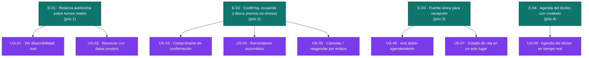

# Épicas y backlog — citasdentista

> Generado por el **Product Owner** desde `inbox/` (mvp-canvas, user-stories,
> requisitos, personas, evidence-map). Cada épica e historia traza a un ítem del
> inbox vía su `origin`. Lo no respaldado por el descubrimiento se declara como
> `open_questions`, no se afirma.
>
> Estas son historias **candidatas**: tienen `as_a/want/so_that`, criterios y una
> primera estimación, pero el refinamiento INVEST estricto (DoR) lo hace el
> Developer en `generate-stories`.

---

## Priorización por valor (no por facilidad técnica)

El orden ataca primero lo más **riesgoso/valioso** según el MVP Canvas:

1. **E-01** — Sin reserva autónoma sobre disponibilidad real no hay producto: es el dolor más repetido entre las tres personas y valida el supuesto raíz "los pacientes sí reservan solos en vez de seguir por WhatsApp".
2. **E-02** — Es la **métrica de éxito** del MVP (bajar la tasa de no-show); contiene el supuesto de impacto más arriesgado: "el recordatorio sí baja el no-show, no solo informa".
3. **E-03** — Habilita la **adopción de recepción**, el riesgo de abandono más crítico del canvas: si recepción no confía en la fuente única ni puede operar rápido en hora pico, vuelve al WhatsApp y todo lo demás es irrelevante.
4. **E-04** — Beneficiario directo (doctor), de alto valor pero **dependiente** de que los datos de cita y estados ya fluyan por el sistema (E-01/E-03); por eso va al final del núcleo.

---

## E-01 · El paciente reserva su cita solo, viendo turnos reales
**Valor (outcome):** El paciente deja de preguntar uno a uno por WhatsApp/llamada y agenda por sí mismo desde el celular sobre horarios que reflejan el estado real; sube el % de citas creadas en el sistema (métrica guía de adopción) y se elimina la desconfianza de "llegar y que no aparezca".
**Origen:** mvp:reserva-online · mvp:ver-disponibilidad · req:R-01 · req:R-02 · req:R-13 · req:R-14 · req:R-17 · pain:sin-visibilidad-horarios · pain:desconfianza-disponibilidad · pain:recopilacion-datos-repetitiva
**Prioridad:** 1
**Historias:** US-01, US-02

## E-02 · El paciente confirma, recuerda y libera su cita (menos no-shows)
**Valor (outcome):** Mueve la **métrica de éxito** del MVP: tasa de no-show. El paciente queda seguro de que reservó, no olvida la cita y puede cancelar/reagendar a tiempo, devolviendo el turno al pool; suben las asistencias y se aprovechan turnos antes perdidos.
**Origen:** mvp:confirmacion-automatica · mvp:recordatorio-automatico · mvp:cancelar-reagendar · req:R-03 · req:R-04 · req:R-05 · pain:incertidumbre-confirmacion · pain:olvido-cita · pain:reagendamiento-laborioso · pain:espacios-perdidos-no-show · pain:impacto-no-shows
**Prioridad:** 2
**Historias:** US-03, US-04, US-05

## E-03 · Recepción opera sobre una única fuente de verdad, sin choques
**Valor (outcome):** Habilita la adopción de recepción: deja de cruzar llamadas/WhatsApp/papel, no se producen dobles agendamientos y el estado de cada cita vive en un solo lugar. Reduce el trabajo manual y el riesgo de abandono del sistema.
**Origen:** mvp:anti-doble-agendamiento · mvp:fuente-unica-estado · req:R-06 · req:R-07 · req:R-15 · pain:doble-agendamiento · pain:multiples-canales-sin-fuente-verdad · pain:confirmacion-manual
**Prioridad:** 3
**Historias:** US-06, US-07

## E-04 · El doctor llega a cada turno informado y con agenda al día
**Valor (outcome):** El doctor deja de atender a ciegas y de sorprenderse con cambios: ve su agenda en tiempo real con el contexto de cada cita, lo que hace la jornada predecible.
**Origen:** mvp:agenda-doctor-tiempo-real · req:R-09 · req:R-10 · pain:sin-contexto-previo · pain:sin-visibilidad-tiempo-real · pain:agenda-impredecible
**Prioridad:** 4
**Historias:** US-08

---

## Backlog del MVP — diagrama

> **Teal** = épica / prioridad (color base). **Morado** = historia candidata que
> aún necesita refinamiento INVEST (lo hará el Developer en `generate-stories`).

---

## Fuera del MVP (postergado — del propio descubrimiento)

No se descomponen en este backlog porque el inbox las declara explícitamente fuera
de alcance del MVP (`mvp-canvas.md` → *Fuera de alcance*; `user-stories.md` → US-09,
US-10, US-11). Entran cuando el núcleo demuestre adopción:

- **US-09** — Bloqueo de rangos de agenda por el doctor (req:R-08).
- **US-10** — Reporte diario por doctor (req:R-11).
- **US-11** — Horarios con mayor ausentismo (req:R-12).

---

## Preguntas abiertas (no respaldadas por el inbox — para el equipo)

- **Canal de confirmación/recordatorio (US-03, US-04):** el inbox dice "comprobante"
  y "recordatorio automático" pero no especifica canal (correo, SMS, WhatsApp). Sin
  decidirlo no se puede medir si el recordatorio baja el no-show.
- **Anticipación del recordatorio (US-04):** R-04 no fija cuántas horas/días antes se
  envía ni si hay más de un envío.
- **Autenticación del paciente / seguridad del enlace (US-05):** R-05 habla de un
  "enlace" para cancelar/reagendar pero no define cómo se evita que un tercero acceda
  a la cita.
- **Validez/expiración del estado `pendiente` (US-02, US-07):** US-02 crea la cita en
  `pendiente` y recepción la "valida", pero el inbox no define qué pasa si nadie la
  valida ni por cuánto tiempo retiene el turno.
- **Resolución de concurrencia (US-06):** R-06 exige que solo una de dos reservas casi
  simultáneas quede registrada, pero el inbox no define la regla (orden de llegada u
  otra). Es decisión de negocio antes que técnica.
- **R-16 (disponibilidad en hora pico):** riesgo no funcional clave del canvas; no se
  modela como historia de valor de usuario sino como restricción para la Arquitectura.
